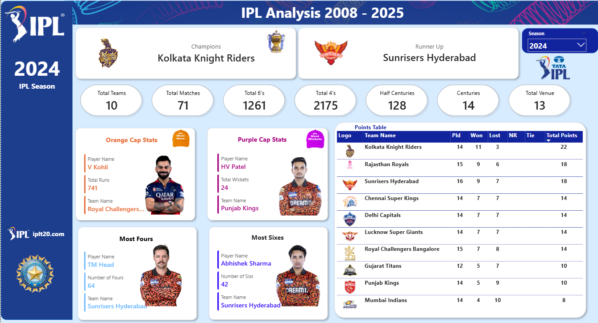

# IPL Power BI Analytics Dashboard

This project presents an interactive **IPL Analytics Dashboard** built using **Microsoft Power BI**.
The dashboard analyzes IPL match and player performance data to generate meaningful insights such as **top run scorers, wicket takers, and team performance statistics**.

---

## Dashboard Preview

---

## Project Features

* Orange Cap Holder (Highest Runs)
* Purple Cap Holder (Highest Wickets)
* Matches Played by Teams
* Matches Won and Lost
* Top Fours Player
* Season-wise IPL Analysis

---

## Tools & Technologies Used

* **Power BI**
* **DAX (Data Analysis Expressions)**
* **Data Modeling**
* **Data Visualization**

---

## Dataset

The dataset used in this project is available on Kaggle.

Kaggle Dataset Link:
https://www.kaggle.com/datasets/avijit18/ipl-cricket-analytics-dataset

---

## Author

**Avijit Jana**

---

## Project File

Power BI Dashboard File:
`IPL_PowerBI_Analytics_Dashboard.pbix`
